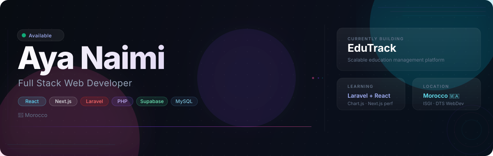
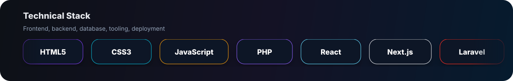

  

 

&ensp;
&ensp;
&ensp;

---

### 👩‍💻 &nbsp;About Me

Full Stack Web Developer based in **Morocco**, currently finishing my DTS in Web Development at ISGI *(2024–2026)*.

I build modern web applications focused on clean interfaces, smooth UX, and well-crafted code — turning ideas into products that actually ship.

 

🏗 &nbsp;**Building** &nbsp;→&nbsp; Trimly  
📚 &nbsp;**Learning** &nbsp;→&nbsp; Laravel × React · Chart.js  
🔭 &nbsp;**Exploring** &nbsp;→&nbsp; Next.js perf · Data visualization  
📍 &nbsp;**Location** &nbsp;→&nbsp; Morocco 🇲🇦  
🎓 &nbsp;**Education** &nbsp;→&nbsp; ISGI — DTS Web Development

 

---

### ⚡ &nbsp;Tech Stack

  

 

---

### 🚀 &nbsp;Featured Projects

> Auto-updated daily · Only named projects *(starting with a capital letter)* are featured.

<!-- AUTO-PROJECTS:START -->
<table>
<tr>
<td width="50%" valign="top">

**[Trimly2](https://github.com/AyaNaimi/Trimly2)**&ensp;

Public repository by Aya Naimi.

&ensp;

</td>
<td width="50%" valign="top">

**[Eventify](https://github.com/AyaNaimi/Eventify)**

Public repository by Aya Naimi.

&ensp;

</td>
</tr>
<tr>
<td width="50%" valign="top">

**[EduTrack](https://github.com/AyaNaimi/EduTrack)**

Public repository by Aya Naimi.

&ensp;

</td>
<td width="50%" valign="top">

**[IKIGAI](https://github.com/AyaNaimi/IKIGAI)**

Public repository by Aya Naimi.

&ensp;

</td>
</tr>
<tr>
<td width="50%" valign="top">

**[SEOUL-NOOK](https://github.com/AyaNaimi/SEOUL-NOOK)**

E-COMERCE WEB SITE (WEB STATIQUE)

&ensp;

</td>
<td width="50%"></td>
</tr>
</table>
<!-- AUTO-PROJECTS:END -->

---

### 📊 &nbsp;GitHub Activity

&nbsp;

---

<strong>"Code is like humor. When you have to explain it, it's bad."</strong>
 
Thanks for visiting — feel free to explore and reach out.

